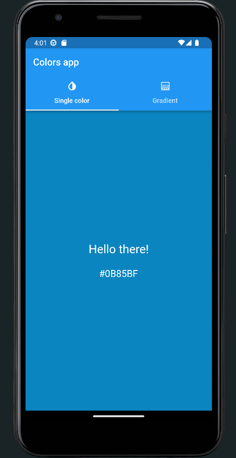
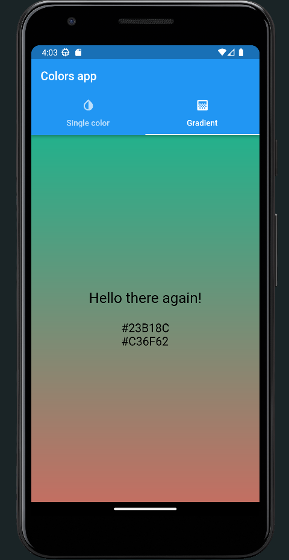

# color_generator  

Simple color generator.

## Features

There is two modes in application: 
 - Single color generator
 - Gradient generator

You can switch them using swipe as soon as just clicking desired tab

## Screenshots

